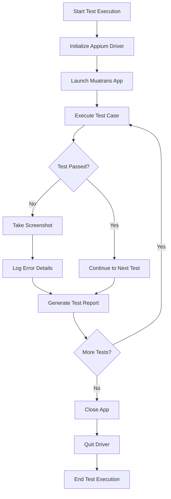

# Muatrans Android Automation Testing Plan

## Project Overview
This document outlines the architecture and implementation plan for the Muatrans cargo shipping feature automation testing using Python + Appium on real Android devices.

## Directory Structure

```
muatrans-automation/
├── pages/                    # Page Object Model (POM) classes
│   ├── base_page.py         # Base page class with common methods
│   ├── login_page.py        # Login page elements and actions
│   ├── shipment_page.py     # Shipment form page elements and actions
│   ├── truck_selection_page.py  # Truck selection page elements and actions
│   └── confirmation_page.py     # Confirmation page elements and actions
├── tests/                    # Test cases organized by feature
│   ├── test_login.py        # Login functionality tests
│   ├── test_shipment_form.py  # Shipment form submission tests
│   ├── test_validation.py   # Input validation tests
│   ├── test_multiple_locations.py  # Multiple locations tests
│   └── test_truck_selection.py     # Truck selection tests
├── config/                   # Configuration files
│   ├── caps.json            # Appium capabilities for real devices
│   └── appium_config.py     # Appium server configuration
├── utils/                    # Utility functions
│   ├── driver_utils.py      # Driver initialization and management
│   ├── screenshot_utils.py  # Screenshot capture utilities
│   ├── logger_utils.py      # Logging utilities
│   └── wait_utils.py        # Explicit wait utilities
├── data/                     # Test data files
│   ├── test_data.json       # General test data
│   ├── shipment_data.json   # Shipment form test data
│   └── validation_data.json # Validation test data
├── reports/                  # Test execution reports
├── screenshots/              # Failure screenshots
├── logs/                     # Execution logs
├── requirements.txt          # Python dependencies
├── pytest.ini               # Pytest configuration
└── conftest.py              # Pytest hooks and fixtures
```

## Implementation Plan

### 1. Dependencies (requirements.txt)
```
Appium-Python-Client==2.11.1
pytest==7.4.3
pytest-html==4.1.1
pytest-xdist==3.5.0
allure-pytest==2.13.2
python-dotenv==1.0.0
pyyaml==6.0.1
```

### 2. Appium Configuration (config/caps.json)
```json
{
  "platformName": "Android",
  "platformVersion": "13",
  "deviceName": "Android Device",
  "automationName": "UiAutomator2",
  "app": "/path/to/muatrans.apk",
  "appPackage": "com.muatmuat.muatrans",
  "appActivity": "com.muatmuat.muatrans.MainActivity",
  "noReset": false,
  "fullReset": false,
  "unicodeKeyboard": true,
  "resetKeyboard": true
}
```

### 3. Page Object Model Structure

#### Base Page (pages/base_page.py)
```python
class BasePage:
    def __init__(self, driver):
        self.driver = driver
    
    def find_element(self, locator):
        # Common element finding logic
    
    def click(self, locator):
        # Common click action
    
    def enter_text(self, locator, text):
        # Common text entry action
    
    def get_text(self, locator):
        # Common get text action
    
    def is_displayed(self, locator):
        # Common visibility check
```

#### Shipment Page (pages/shipment_page.py)
```python
from pages.base_page import BasePage

class ShipmentPage(BasePage):
    # Element locators
    PICKUP_LOCATION = ("id", "com.muatmuat.muatrans:id/pickupLocation")
    DROPOFF_LOCATION = ("id", "com.muatmuat.muatrans:id/dropoffLocation")
    CARGO_WEIGHT = ("id", "com.muatmuat.muatrans:id/cargoWeight")
    SUBMIT_BUTTON = ("id", "com.muatmuat.muatrans:id/submitBtn")
    
    def enter_pickup_location(self, location):
        self.enter_text(self.PICKUP_LOCATION, location)
    
    def enter_dropoff_location(self, location):
        self.enter_text(self.DROPOFF_LOCATION, location)
    
    def enter_cargo_weight(self, weight):
        self.enter_text(self.CARGO_WEIGHT, weight)
    
    def submit_shipment(self):
        self.click(self.SUBMIT_BUTTON)
```

### 4. Test Data Management (data/shipment_data.json)
```json
{
  "valid_shipments": [
    {
      "pickup": "Jakarta",
      "dropoff": "Bandung",
      "weight": "100",
      "expected_result": "success"
    },
    {
      "pickup": "Surabaya",
      "dropoff": "Malang",
      "weight": "50",
      "expected_result": "success"
    }
  ],
  "invalid_shipments": [
    {
      "pickup": "",
      "dropoff": "Bandung",
      "weight": "100",
      "expected_error": "Pickup location is required"
    },
    {
      "pickup": "Jakarta",
      "dropoff": "",
      "weight": "100",
      "expected_error": "Dropoff location is required"
    }
  ]
}
```

### 5. Test Implementation (tests/test_shipment_form.py)
```python
import pytest
import json
from pages.shipment_page import ShipmentPage
from utils.driver_utils import get_driver
from utils.screenshot_utils import take_screenshot

class TestShipmentForm:
    @pytest.fixture
    def shipment_page(self):
        driver = get_driver()
        page = ShipmentPage(driver)
        yield page
        driver.quit()
    
    def test_successful_shipment(self, shipment_page):
        # Load test data
        with open('data/shipment_data.json') as f:
            test_data = json.load(f)
        
        # Get valid shipment data
        valid_shipment = test_data['valid_shipments'][0]
        
        # Fill form
        shipment_page.enter_pickup_location(valid_shipment['pickup'])
        shipment_page.enter_dropoff_location(valid_shipment['dropoff'])
        shipment_page.enter_cargo_weight(valid_shipment['weight'])
        
        # Submit form
        shipment_page.submit_shipment()
        
        # Verify successful submission
        # Add assertions here
    
    def test_empty_pickup_location(self, shipment_page):
        # Load test data
        with open('data/shipment_data.json') as f:
            test_data = json.load(f)
        
        # Get invalid shipment data
        invalid_shipment = test_data['invalid_shipments'][0]
        
        # Fill form with empty pickup
        shipment_page.enter_pickup_location(invalid_shipment['pickup'])
        shipment_page.enter_dropoff_location(invalid_shipment['dropoff'])
        shipment_page.enter_cargo_weight(invalid_shipment['weight'])
        
        # Submit form
        shipment_page.submit_shipment()
        
        # Verify error message
        # Add assertions here
```

### 6. Utility Functions

#### Driver Utils (utils/driver_utils.py)
```python
from appium import webdriver
import json
from config.appium_config import APPIUM_SERVER_URL

def get_driver():
    with open('config/caps.json') as f:
        caps = json.load(f)
    
    driver = webdriver.Remote(APPIUM_SERVER_URL, caps)
    return driver
```

#### Screenshot Utils (utils/screenshot_utils.py)
```python
import os
import time
from datetime import datetime

def take_screenshot(driver, test_name):
    timestamp = datetime.now().strftime("%Y%m%d_%H%M%S")
    screenshot_dir = "screenshots"
    
    if not os.path.exists(screenshot_dir):
        os.makedirs(screenshot_dir)
    
    screenshot_path = f"{screenshot_dir}/{test_name}_{timestamp}.png"
    driver.save_screenshot(screenshot_path)
    return screenshot_path
```

### 7. Pytest Configuration (pytest.ini)
```ini
[pytest]
testpaths = tests
python_files = test_*.py
python_classes = Test*
python_functions = test_*
addopts = -v --html=reports/test_report.html --self-contained-html
```

### 8. Test Execution Workflow



## Next Steps

1. Create the directory structure as outlined above
2. Set up Appium configuration for real Android devices
3. Implement the Page Object Model classes
4. Create utility functions for driver management, screenshots, and logging
5. Develop test data files
6. Implement test cases for core functionality
7. Set up pytest configuration
8. Execute tests and validate results

## Element Locator Strategy

We'll use the following priority for element locators:
1. Resource ID (most stable)
2. Accessibility ID
3. XPath (as a last resort)

Example locators for the shipment form:
- Pickup location: `com.muatmuat.muatrans:id/pickupLocation`
- Dropoff location: `com.muatmuat.muatrans:id/dropoffLocation`
- Cargo weight: `com.muatmuat.muatrans:id/cargoWeight`
- Submit button: `com.muatmuat.muatrans:id/submitBtn`

## Test Scenarios

### Core Functionality
1. Successful shipment form submission
2. Invalid input validation (empty fields, invalid formats)
3. Multiple pick-up/drop-off points
4. Truck type selection
5. Additional services selection

### Edge Cases
1. Network connectivity issues
2. App backgrounding during form submission
3. Large cargo weight values
4. Special characters in location names
5. Rapid form submissions

## Reporting and Logging

- HTML test reports using pytest-html
- Screenshot capture on test failures
- Detailed logging for debugging
- Allure reports for advanced reporting (optional)

## Future Enhancements

1. CI/CD integration (Jenkins/GitHub Actions)
2. Parallel test execution
3. Cloud device farm integration (BrowserStack/Sauce Labs)
4. Performance testing integration
5. API testing for backend validation